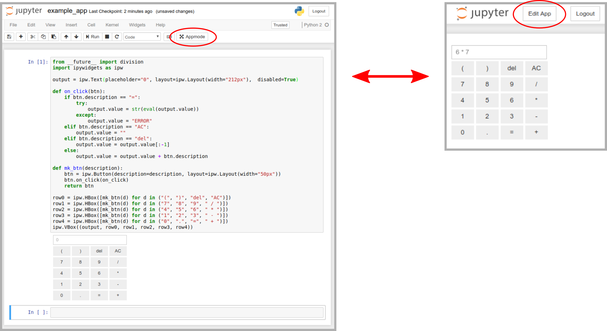

# Appmode

**Curvas de indiferencia.**



## Try it live

[](https://mybinder.org/v2/gh/oschuett/appmode/master?urlpath=%2Fapps%2Fexample_app.ipynb)

Da click en la liga de binder para que vayas directo a la aplicación. Puedes descargar (clonar) las carpetas para explorar su contenido.


If you want to use [mybinder](https://mybinder.org) add the following `environment.yml` file to your repository:
```
channels:
  - conda-forge
dependencies:
  - appmode
```

## Server Side Configuration

Appmode adds the following [configuration options](https://jupyter-notebook.readthedocs.io/en/stable/config.html):
- `Appmode.trusted_path` Run only notebooks below this path in Appmode. Default: No restrictions.
- `Appmode.show_edit_button` Show _Edit App_ button during Appmode. Default: True.
- `Appmode.show_other_buttons` Show other buttons, e.g. Logout, during Appmode. Default: True.

## Client Side Customization

The UI elements of Appmode can be customized via the [custom.js](http://jupyter-notebook.readthedocs.io/en/stable/examples/Notebook/JavaScript%20Notebook%20Extensions.html#custom.js) file. Some examples are:
```
$('#appmode-leave').hide();                          // Hides the edit app button.
$('#appmode-busy').hide();                           // Hides the kernel busy indicator.
$('#appmode-loader').append('<h2>Loading...</h2>');  // Adds a loading message.
```
Beware that hiding the edit button does not prevent users from leaving Appmode by changing the URL manually.

## Development

With the included [Dockerfile](./Dockerfile) a development environment can be quickly created:

1. Install [Docker](https://docs.docker.com/engine/installation/).
2. git clone this repository
3. `docker build --tag appmode_dev ./`
4. `docker run --init -ti -p127.0.0.1:8888:8888 appmode_dev`
5. Browse to `http://localhost:8888/apps/example_app.ipynb`

## Acknowledgements
Appmode has been developed with the support of the [NCCR MARVEL](http://nccr-marvel.ch/) funded by the Swiss National Science Foundation.
